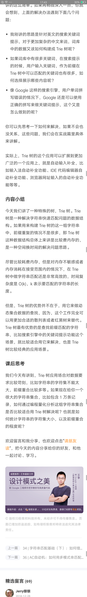

# 数据结构与算法之美

## 开篇词|从今天起，跨过“数据结构与算法”这道坎

## 01|为什么要学习数据结构和算法？

## 02|如何抓住重点，系统高效地学习数据结构与算法？

## 03|复杂度分析（上）：如何分析、统计算法的执行效率和资源？

## 04|复杂度分析（下）：浅析最好、最坏、平均、均摊时间复杂度？

## 05| 数组：为什么很多编程语言中数组都是从0开始编号？

## 06|链表（上）:如何实现LRU缓存淘汰算法？

## 07|链表（下）:如何轻松写出正确的链表代码？

## 08|栈：如何实现浏览器的前进后退功能？

## 09|队列:队列在线程池等有限资源池中的利用

## 10|递归：如何用三行代码找到在“最终推荐人”？

## 11|排序（上）：为什么插入排序比冒泡排序更受欢迎？

## 12|排序（下）：如何利用快拍思想在O（n）内查找第k大元素？

## 13|线性排序：如何根据年龄给100万用户数据排序？

## 14|排序优化：如何实现一个通用的、高性能的排序函数？

## 15|二分查找（上）：如何用最省内存的方式实现快速查找功能

## 16|二分查找（下）L如何快速定位ip对应的省份地址？

## 17|跳表：为什么redis一定要用跳表来实现有序集合？

## 18|散列表（上）：word文档中的单词拼写检查功能是如何实现的？

## 19|散列表（中）：如何打造一个工业级水平的散列表？

## 20|散列表（下）：为什么散列表和链表经常会一起使用？

## 21|哈希算法（上）：如何方式数据库中的用户信息被脱库?

## 22|哈希算法（下）：哈希算法在分布式系统中有哪些应用？

## 23|二叉树基础（上）：什么样的二叉树适合用数组来存储？

## 24|二叉树基础（下）：有了如此高效的散列表，为什么还需要...

## 25|红黑树（上）：为什么工程大都用红黑树这种二叉树？

## 26|红黑树（下）：掌握这些技巧，你也可以实现一个红黑树？

## 27|递归树：如何借助树来求解递归算法的时间复杂度？

## 28|堆和堆排序：为什么说堆排序没有快速排序快？

## 29|堆的应用：如何快速获取到Top10最热门的搜索关键词？

## 30|图的表示：如何存储微博、微信等社交网络中的好友关系？

## 31|深度和广度优先搜索：如何找出社交网络中的三度好友关系？

## 32|字符串匹配基础（上）：如何借助哈希算法实现高效字符串的匹配？

## 33|字符串匹配基础（中）：如何实现文本编辑器中的查找功能

## 34| 字符串匹配基础（下）：如何借助BM 算法轻松理解KMP算法？

## 35|Trie树：如何实现搜索引擎关键词提示功能？

## 36|AC自动机：如何用多模式串匹配实现敏感词过滤功能？

## 37|贪心算法：如何用贪心算法实现huffman压缩编码？

## 38|分治算法：谈一谈大规模计算MapReduce中的分治思想

## 39|回溯算法：从电影《蝴蝶效应》中学习回溯算法的核心思想

## 40|初识动态规划：如何巧妙解决“双十一”购物时的凑单问题？

## 41|动态规划理论：一篇文章带你彻底搞懂最优子结构、无后效...

## 42|动态规划实战：如何实现搜索引擎中的拼写纠错功能？

## 43|拓扑排序：如何确定代码源文件的编译依赖关系？

## 44.最短路径：地图软件是如何计算出最优出行路径的？

## 45|位图：如何实现网页爬虫中的url去重功能？

## 46|概率统计：如何利用朴素贝叶斯算法过滤垃圾短信？

## 47|向量空间：如何实现一个简单的音乐推荐系统？

## 48|B+树：mysql数据库索引是如何实现的？

## 49|搜索：如何用A*搜索算法实现游戏中的寻路功能？

## 50|索引：如何在海量数据中快速查找某个数据？

## 51|并行算法：如何利用并行处理提高算法的执行效率？

## 52|算法实战（一）：剖析Redis常用数据类型对应的数据结构

## 53|算法实战（二）：剖析搜索引擎背后的经典数据结构与算法

## 54|算法实战（三）：剖析高性能队列disruptor背后的数据结构与算法

## 55|算法实战（四）：剖析微服务接口鉴权限流背后的数据结构与算法

## 56|算法实战（五）：如何利用学过的数据结构与算法实现一个短网址？

## 不定期福利第一期|数据结构与算法学习书单

## 不定期福利第二期

## 不定期福利第三期|测一测你的算法阶段学习成果

## 不定期福利第三期|学习经验分享

## 总结课

## 《数据结构与算法之美》学习指导手册

## 春节7天练|day01:数组和链表

## 春节7天练|day02:栈、队列和递归

## 春节7天练|day03:排序和二分查找

## 春节7天练|day04:散列表和字符串

## 春节7天练|day05:二叉树和堆

## 春节7天练|day06:图

## 春节7天练|day07:贪心、分治、回溯和动态规划
